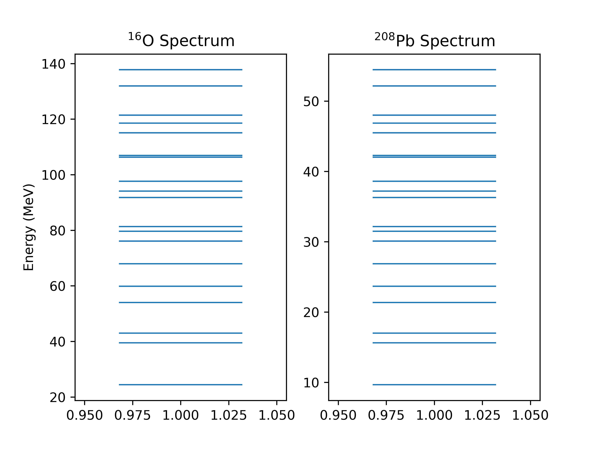

# Results

```
χ^2 Before (protons): 0.20342077287111016
Proton Params (κ,μ'): [0.07165604 0.03582801]
Proton Param Uncertainties: [0.60947788 0.26942372]
Neutron Params (κ,μ'): [0.06045801 0.03022901]
Neutron Param Uncertainties: [1.23942981 0.25393164]
χ^2 After (protons): 0.08813755700149778
```

I don't know if the uncertainties are correlated.

I don't know what the next magic gap is.